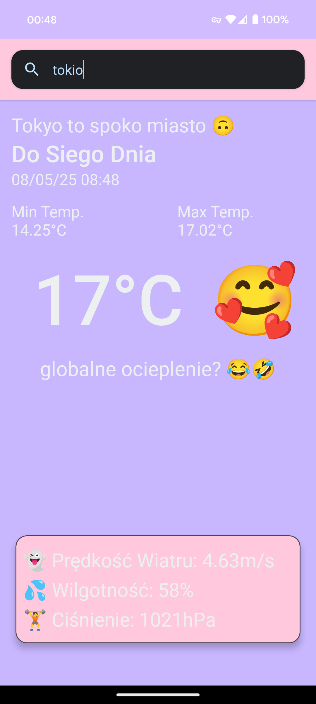
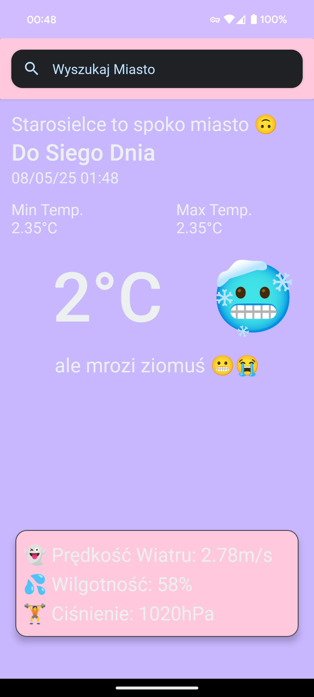

# GitWeather
> A simple weather app made as a part of an assigment. It uses OpenWeather API and phones location to display current weather.

## Installation
Clone this repository and open it with `Android Studio`. [API key](https://gist.github.com/lalithabacies/c8f973dc6754384d6cade282b64a8cb1) is already provided so everything should work out of the box.

## Usage
Application will ask you for your location. Grant it and it will display weather in a city you live in. Use search bar to check weather in different cities.

## Screenshots

